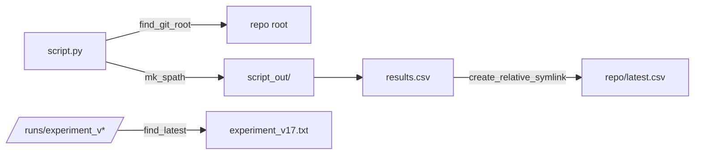
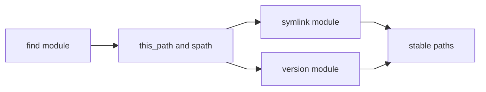

# scitex-path

<p align="center">
  <a href="https://scitex.ai">
    
  </a>
</p>

<p align="center"><b>Scientific project path utilities — find files / git root, symlink mgmt, version increment.</b></p>

<p align="center">
  <a href="https://scitex-path.readthedocs.io/">Full Documentation</a> · <code>uv pip install scitex-path[all]</code>
</p>

<!-- scitex-badges:start -->
<p align="center">
  <a href="https://pypi.org/project/scitex-path/"></a>
  <a href="https://pypi.org/project/scitex-path/"></a>
  <a href="https://scitex-path.readthedocs.io/en/latest/"></a>
</p>
<p align="center">
  <a href="https://github.com/ywatanabe1989/scitex-path/actions/workflows/pytest-matrix-on-ubuntu-py3-11-3-12-3-13.yml"></a>
  <a href="https://github.com/ywatanabe1989/scitex-path/actions/workflows/import-smoke-on-ubuntu-py3-12.yml"></a>
  <a href="https://codecov.io/gh/ywatanabe1989/scitex-path"></a>
</p>
<!-- scitex-badges:end -->

---

## Problem and Solution

| # | Problem | Solution |
|---|---------|----------|
| 1 | **Hard-coded paths** — scripts break on other machines. | **Auto-resolve** — find_git_root plus get_spath fixes locations. |
| 2 | **Scattered outputs** — every script invents its own out-dir. | **Canonical helpers** — mk_spath and friends standardize layout. |

## Quick Start

```python
import scitex_path as sp

git_root = sp.find_git_root()
matches = sp.find_file("/data/project", "*.csv")
```

## Demo



<p align="center"><sub><b>Figure 1.</b> Path resolution flow from calling script to versioned outputs.</sub></p>

```python
import scitex_path as sp

root = sp.find_git_root()                                # → /home/me/proj/myrepo
out  = sp.mk_spath("results.csv")                        # → <script>_out/results.csv
sp.create_relative_symlink(out, root / "latest.csv")
print(sp.find_latest("/runs", "experiment", ".txt"))     # → /runs/experiment_v17.txt
```

```
/home/me/proj/myrepo
/home/me/proj/myrepo/scripts/train_out/results.csv
/runs/experiment_v17.txt
```

## Installation

```bash
uv pip install "scitex-path[all]"
```

<details>
<summary><b>Per-module extras</b></summary>

<br>

| Extra | Pulls in |
|---|---|
| `dev` | pytest, pytest-cov, scitex-dev |
| `docs` | Sphinx plus theme and myst-parser |
| `all` | dev plus docs (recommended) |

```bash
uv pip install "scitex-path[dev]"  # contributors
uv pip install -e ".[dev]"         # editable install
```

</details>

## Architecture

### 1. Find and resolve

`find_file`, `find_dir`, and `find_git_root` locate files and the repo root without hard-coded paths.

### 2. Session outputs

`mk_spath`, `get_spath`, and `this_path` anchor outputs to the calling script's `_out` directory.

### 3. Links and versions

`symlink` helpers manage links while `increment_version` and `find_latest` handle versioned runs.



<p align="center"><sub><b>Figure 2.</b> Module collaboration from discovery to stable versioned paths.</sub></p>

## 1 Interfaces

<details open>
<summary><strong>Python API</strong></summary>

<br>

```python
import scitex_path as sp

# Find
sp.find_file("/data/project", "*.csv")
sp.find_dir("/runs", "results_*")
sp.find_git_root()

# Path manipulation
sp.split("/home/user/project/data/results.csv")
sp.clean("path/with/../spaces ")
sp.getsize("/path/to/dir")

# Symlinks
sp.symlink("/data/raw", "/project/data/raw")
sp.create_relative_symlink(src, dst)
sp.list_symlinks("/project/data")
sp.fix_broken_symlinks("/project/data")
sp.resolve_symlinks(path)

# Versioning
sp.increment_version("/runs", "experiment", ".txt")  # → /runs/experiment_v001.txt
sp.find_latest("/runs", "experiment", ".txt")        # → /runs/experiment_v003.txt

# Session paths (relative to calling script)
sp.this_path() / sp.get_this_path()
sp.get_spath(filename) / sp.mk_spath(filename)
```

</details>

## Part of SciTeX

`scitex-path` is part of [**SciTeX**](https://scitex.ai). Install via
the umbrella with `pip install scitex[path]` to use as
`scitex.path` (Python) or `scitex path ...` (CLI).

>Four Freedoms for Research
>
>0. The freedom to **run** your research anywhere — your machine, your terms.
>1. The freedom to **study** how every step works — from raw data to final manuscript.
>2. The freedom to **redistribute** your workflows, not just your papers.
>3. The freedom to **modify** any module and share improvements with the community.
>
>AGPL-3.0 — because we believe research infrastructure deserves the same freedoms as the software it runs on.

## License

AGPL-3.0 — see [LICENSE](LICENSE) for details.

---

<p align="center">
  <a href="https://scitex.ai" target="_blank"></a>
</p>
